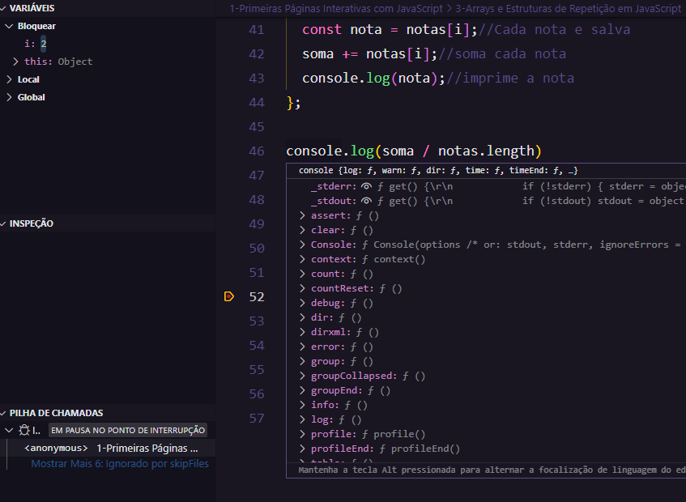

# Arrays e Estruturas de Repetição

Arrays são conhecidos como Listas, que são uma ***coleção encomendada*** , onde temos um 1o, um 2o, um 3o elemento e assim por diante.

```javascript
let fruits = ["Apple", "Orange", "Plum"];

const alunos = [`Aluno1`,`Aluno2`,`Aluno3`];
```

O Array possui vários métodos, imagine que você deseja inserir um elemento nele. Sendo assim, existem algumas maneiras:

```javascript
//criando um array para notas
let notas = [];//Cria um array vazio

//Inserindo pelo metodo push())
notas.push(5);//notas1
notas.push(6);//notas2
notas.push(7);//notas3
notas.push(8);//notas4

//Alternativa ao push
notas[4] = 10
```

Além de adicionar, também podemos remover elementos e para isso, temos

```javascript
// //Remove o ultimo
notas.pop();

// //Remove apenas o PRIMEIRO
notas.shift();
```


# Estruturas de Repetição

Uma estrutura de repetição comumente usada é o FOR, o qual possui a seguinte estrutura.

```javascript
for (let index = 0; index < array.length; index++) {
  const element = array[index];
  
}
```

Um exemplo de aplicação, é por exemplo, a soma dos números (itens) de um Array. Confira:

```javascript
// Conhecendo a estrutura for
let soma = 0;
for (let i = 0; i < notas.length; i++) {
  const nota = notas[i];//Cada nota e salva
  soma += notas[i];//soma cada nota
  console.log(nota);//imprime a nota
};

console.log(soma / notas.length)
```

No código acima, a variável SOMA é responsável por armazenar a soma de cada item. Ao entrar no FOR, ele irá passar por cada elemento, mostrando na tela todos eles e, por fim, sua média.

Agora tente você, crie um código em JS que printe cada letra do seu nome em uma linha separada. Veja um exemplo de código:

```javascript
const nome = `GabrielVictorino`//Considera-se como uma lista especial (metodos proprios)

// console.log(nome[0]);//Imprime a primeira letra

for(let i = 0; i < nome.length; i++){
  console.log(nome[i]);//Imprime cada letra.
}

```


# Depuração

A arte de depurar um código corresponde com analisar parte a parte dele, comando por comando, estrutura por estrutura, buscando entender e identificar possiveis erros. Veja:


