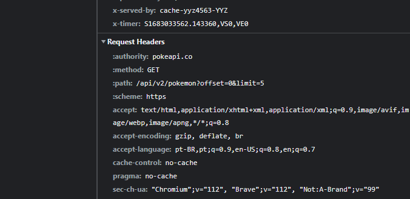

# Requisições

O protocolo HTTP se trata de um protocolo cliente e servidor. Para montarmos, devemos saber o seguinte.

URL: https://pokeapi.co/api/v2/pokemon

# Path Params e Query String

Na aula vemos dois jeitos de solicitar os dados para o servidor. Abaixo segue uma URL de exemplo para fazer a solicitação:

```
URL: https://pokeapi.co/api/v2/pokemon?offset=0&limit=5

```

O retorno da solicitação acima é:

```json
{
  "count": 1281,
  "next": "https://pokeapi.co/api/v2/pokemon?offset=5&limit=5",
  "previous": null,
  "results": [
    {
      "name": "bulbasaur",
      "url": "https://pokeapi.co/api/v2/pokemon/1/"
    },
    {
      "name": "ivysaur",
      "url": "https://pokeapi.co/api/v2/pokemon/2/"
    },
    {
      "name": "venusaur",
      "url": "https://pokeapi.co/api/v2/pokemon/3/"
    },
    {
      "name": "charmander",
      "url": "https://pokeapi.co/api/v2/pokemon/4/"
    },
    {
      "name": "charmeleon",
      "url": "https://pokeapi.co/api/v2/pokemon/5/"
    }
  ]
}
```

Esse modo é conhecido como QueryString, com ela passamos "filtros" para o servidor nos retornar dados. Perceba que usamos o "?" no começo dela e "&" para indicar mais filtros.

Já o PathParam estabelece o "/" para solicitar os dados, veja:

```json
URL: https://pokeapi.co/api/v2/pokemon/1
```

# Headers

O Header faz parte do protocolo HTTP, transmitindo informações adicionais (metadados). Elas podem conter várias coisas, por exemplo: data de solicitação, linguagem (idioma), etc. Para saber mais campos, veja em `https://en.wikipedia.org/wiki/List_of_HTTP_header_fields`

Durante a aula vimos dois Headers, o primeiro é o `Request `e o segundo é o `Response`.

O **Request Headers** é a configuração, por exemplo, qual lingaguem é aceita pelo browser. São as exigências que fazemos para o servidor nos responder. Veja:



# Body e Status Code

Uma outra área de dados é o **Body**, com o dado que queremos trafegar na requisição. Para ele, passamos o `content-type` no Request Header, que corresponderia a `application/json` . Por exemplo, quando solicitamos uma api, ela nos retornará no body um tipo de dados.

Já o Status Code indica como a requisição respondeu. Neste caso, ele retorna alguns códigos, como é mostrado na tabela abaixo:

1. [Informational responses](https://developer.mozilla.org/en-US/docs/Web/HTTP/Status#information_responses) (`100` – `199`)
2. [Successful responses](https://developer.mozilla.org/en-US/docs/Web/HTTP/Status#successful_responses) (`200` – `299`)
3. [Redirection messages](https://developer.mozilla.org/en-US/docs/Web/HTTP/Status#redirection_messages) (`300` – `399`)
4. [Client error responses](https://developer.mozilla.org/en-US/docs/Web/HTTP/Status#client_error_responses) (`400` – `499`)
5. [Server error responses](https://developer.mozilla.org/en-US/docs/Web/HTTP/Status#server_error_responses) (`500` – `599`)

Veja:


# Resumo

URL

Request Method

Request Header

Responde Header

Body

Response Body

Status Code

# Referências

[_Cabeçalhos HTTP_](https://www.seobility.net/en/wiki/HTTP_headers)

[_List of HTTP header fields_](https://en.wikipedia.org/wiki/List_of_HTTP_header_fields)

[_Request Header_](https://developer.mozilla.org/en-US/docs/Glossary/Request_header)

[_HTTP Headers_](https://developer.mozilla.org/en-US/docs/Web/HTTP/Headers)

[_HTTP response status codes_](https://developer.mozilla.org/en-US/docs/Web/HTTP/Status)
