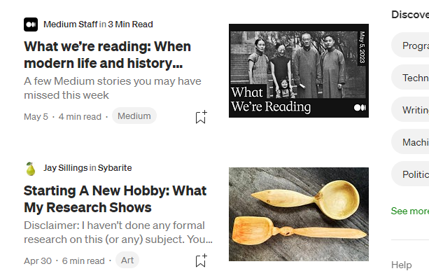
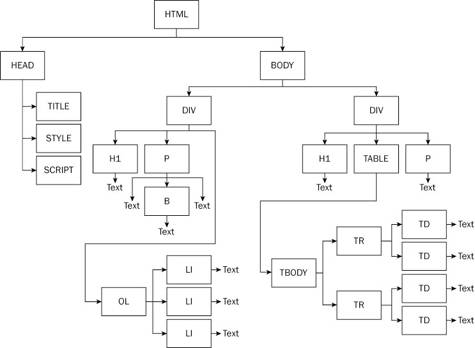

# Web Components

São especificações elaboradas para permitir a criação de elementos web e customizá-los mais fácil e rapidamente, manipulando-os de forma independente.

# Web Components vs Elements

Você já se perguntou por que não podemos usar apenas o HTML e CSS para construir sites? Bom, veja o seguinte exemplo:

> https://medium.com/



Perceba estes elementos, quando acessamos a inspeção dele no navegador, vemos que sua construção é composta por várias tags, div, p, img, etc. No entanto, quando temos muitos elementos, poderiámos criar uma punica tag chamada "noticias" e ela traria toda essa construção muito mais facilmente.

# Entendendo o DOM

É a rendenrização em "árvore" das tags html. Veja a imagem abaixo:



# Shadow DOM

Podemos misturar nossa árvore com a árvore do navegador, podemos **criar** a nossa própria e **adaptá-la** (total controle).

### Definindo um Component

Component são funções que retornam js, html e css. Ele é o conjunto de elementos html, com uma estilização exclusiva para esses componentes. Vamos imaginar um componente semelhante a um veículo, você sabe como o motor funciona? Conhece todas as peças que compõe o motor? Se você for um engenheiro, sim, mas normalmente não sabemos nada disso, e mesmo assim, todos os dias apenas sentamos nos veículos, ligamos e vamos embora. A ideia principal de components é isso, só iremos usar sem se preocupar em prepará-lo, pois já foi feito.

Sua construção já foi realizada, sua estilização própria também, e suas props (propriedades) já foram definidas.

Confira abaixo um exemplo de Web Component:

```javascript
class CardNews extends HTMLElement {
  // Aqui, estamos criando um molde (a classe) que funciona como elementos HTML
  constructor() {
    super() // Chama o construtor do HTMLElement

    const shadow = this.attachShadow({ mode: "open" })
    shadow.innerHTML = "<h1>Hello World!</h1>"
  }
}

customElements.define("card-news", CardNews)
```

### Dinamismo

Para deixarmos mais dinâmico, usamos o this.getAtributte veja:

```javascript
    const componentRoot = document.createElement("h1")
    // componentRoot.textContent = `Minha Noticia`
    componentRoot.textContent = this.getAttribute("titulo")

```

Assim, no html, trabalhamos da seguinte forma:

```
    <card-news></card-news>
    <titulo-dinamico titulo="Noticia Urgente"></titulo-dinamico>
    <titulo-dinamico titulo="Noticia Urgente 2"></titulo-dinamico>
```
